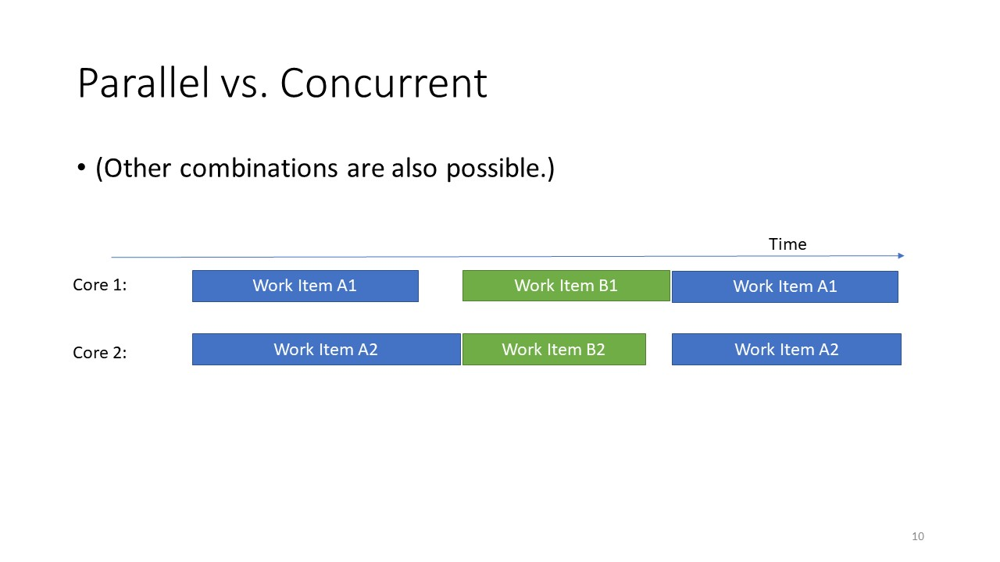
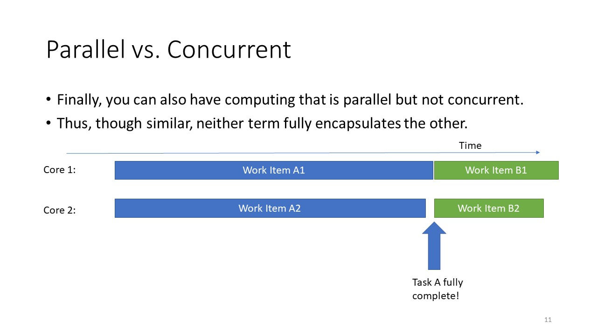
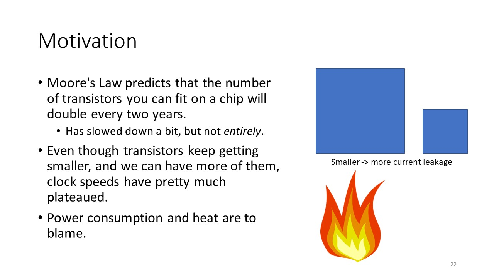
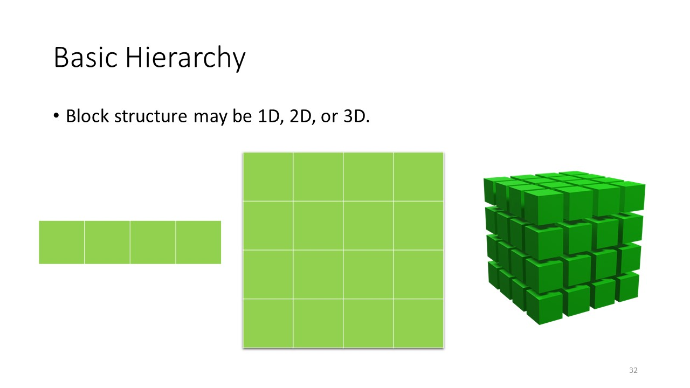
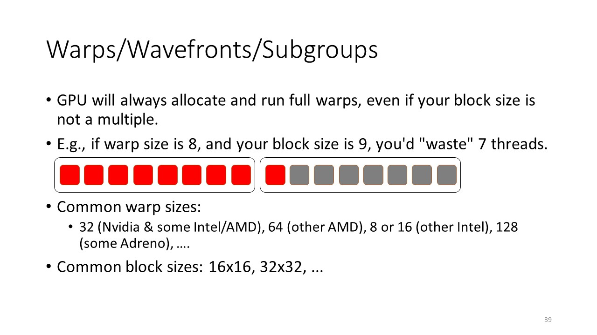

# Iframe Test
Leaving this here as a reminder to myself that iframe embeddings do work here. It won't show up in the github.com view, but if you actually visit [https://cm-1.github.io](https://cm-1.github.io), you can play the video.

<iframe width="420" height="345" src="https://www.youtube.com/embed/3EktRV4mYPw?controls=0">
</iframe>

Some more text.

